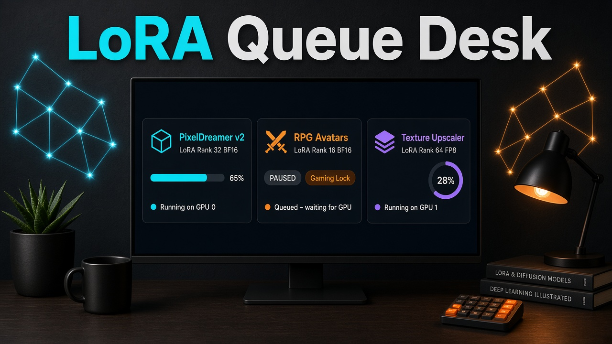

# LoRA Queue Desk



Local desk for a ComfyUI LoRA queue. It shows which packs are already on the server and which are still waiting, and it keeps training jobs in three states: **running**, **paused**, and **waiting**.

A gaming / projection lock can pause work that is already running. While that lock is on, the desk will not start or resume anything.

This is a small installable Python tool: a CLI, a loopback status page, and a mock ComfyUI client so you can try it with no server.

## Install

Requires Python 3.11 or newer. There are no runtime dependencies.

```bash
python -m pip install -e ".[dev]"
```

The console script is `lora-queue`. `python -m lora_queue_desk` is the same entry point.

## Demo

Demo mode uses an in-memory ComfyUI client. It does not open a socket.

```bash
lora-queue --demo status
```

The sample queue matches the cover, plus one waiting job so all three states show up:

| Job | State | Pack |
| --- | --- | --- |
| PixelDreamer v2 | running on GPU 0, 65%, rank 32 BF16 | installed |
| RPG Avatars | paused by the gaming lock, rank 16 BF16 | installed |
| Texture Upscaler | running on GPU 1, 28%, rank 64 FP8 | installed |
| Icon Sheet | waiting, rank 8 BF16 | not on the server |

RPG Avatars starts paused even though the lock is off. That is deliberate: turning the lock off must not resume GPU work. Resume is a separate command, and it refuses while the lock is on.

```bash
lora-queue --demo lock on
lora-queue --demo resume rpg-avatars   # refused, exit 3
lora-queue --demo lock off
lora-queue --demo resume rpg-avatars
```

Demo jobs are stored in `demo-queue.json`. A live queue uses `queue.json` in the same data directory. The flag file `gaming.lock` is shared, so a lock you flip in demo mode also blocks a live start.

Pass `--data-dir` to keep that state somewhere other than the default.

## Commands

```text
lora-queue status
lora-queue lock on
lora-queue lock off
lora-queue lock status
lora-queue queue
lora-queue queue add --name "Portrait Styles" --lora portrait-styles --rank 4 --precision BF16
lora-queue start [job-id]
lora-queue pause [job-id]
lora-queue resume [job-id]
lora-queue loras
lora-queue serve
```

`queue add` only appends a waiting job. It does not start it, including when the lock is on. You can line work up while a game is running.

`start` with no id takes the first waiting job. `pause` with no id pauses every running job. `resume` with no id prefers a job the lock paused.

`serve` binds `127.0.0.1:8765` and serves a read-only page. A non-loopback host needs `--allow-remote`.

Exit codes: `0` ok, `2` bad usage, `3` the gaming lock refused a start or resume, `4` a bad id or local state, `5` ComfyUI could not be used for a command that needed it. `status` still prints the local queue when the server is down.

## Configuration

Resolution order is CLI flag, then environment, then TOML, then the default.

| Setting | Flag | Environment | Default |
| --- | --- | --- | --- |
| ComfyUI URL | `--comfy-url` | `LORA_QUEUE_COMFY_URL` | `http://192.168.4.47:8188` |
| Demo client | `--demo` | `LORA_QUEUE_DEMO=on` | off |
| Data directory | `--data-dir` | `LORA_QUEUE_DATA_DIR` | `$XDG_DATA_HOME/lora-queue-desk` or `~/.local/share/lora-queue-desk` |
| Request timeout | | `LORA_QUEUE_TIMEOUT` | `3` seconds |
| API prefix | | `LORA_QUEUE_API_PREFIX` | empty |

Copy `config.example.toml` to `lora-queue.toml` in the current directory, or pass `--config`. There is no API key and no login. ComfyUI on a LAN is addressed by URL only.

If a reverse proxy mounts the server under `/api`, set `api_prefix = "/api"`. The client then calls `/api/system_stats`, `/api/models/loras`, and `/api/queue`.

## Gaming lock

The lock is on when **any** source says so. Starts and resumes check the lock and return exit code 3 without calling the backend.

| Source | Turn on | Turn off |
| --- | --- | --- |
| Flag file | `lora-queue lock on` writes `$DATA_DIR/gaming.lock` | `lora-queue lock off` deletes that file |
| Environment | `LORA_QUEUE_GAMING_LOCK=on` or `LORA_QUEUE_PRESENCE_LOCK=on` (`1`, `true`, and `yes` count too) | Unset the variable. `lock off` does not unset it |
| Detector | A `PresenceDetector` you pass in code. The built-in detector always reports clear | Make `gaming_or_projection_active()` return false |

You can flip the flag by hand:

```bash
touch ~/.local/share/lora-queue-desk/gaming.lock
rm ~/.local/share/lora-queue-desk/gaming.lock
```

A file whose contents are `off`, `0`, `false`, or `no` does not engage the lock. Anything else in the file, including an empty file, does. `lock on` writes `on`.

What the lock does:

- `lock on` asks the backend to interrupt every running job, then marks successful interruptions `paused` with `paused_by_lock`. If an interrupt fails, the job remains `running` with a detail message so the desk does not claim the GPU stopped.
- `start` and `resume` do nothing to the GPU while the lock is on. The job stays waiting or paused.
- `lock off` only clears the flag file. Jobs stay paused. Run `lora-queue resume` when the machine is free.
- Adding a job is allowed while the lock is on. Starting it is not.

The detector is a stub on purpose. `NullPresenceDetector.gaming_or_projection_active` returns false. To hook a real check (a fullscreen process, a projector, a Stream Deck button), pass another object with that method into `GamingLock`. If the detector raises, the lock fails closed (`detector-error`) so a broken check cannot start GPU work.

`GamingLock` is the presence lock. Same object, both names.

## ComfyUI client

`HttpComfyClient` talks to the server you configured:

- `GET /system_stats` for health and device names
- `GET /models/loras` for installed pack filenames
- `GET /queue` for the server's prompt queue (running and pending counts)
- `POST /interrupt` when a running job is paused
- `POST /prompt` only if you call `submit_prompt` yourself with a workflow you built

The desk's `start` and `resume` mark a job running in the local queue after a health check. They do **not** post a training graph. A live URL cannot start a GPU job through this starter. Wiring a real trainer workflow is left as an explicit next step so the default path stays safe.

`MockComfyClient` returns the demo pack list and two mock GPUs. `lora-queue --demo` uses it. Tests use it, or a fake HTTP transport, and do not need a network.

Pack names on a job are filename stems. `pixel-dreamer-v2.safetensors` satisfies a job whose lora is `pixel-dreamer-v2`. A stem with no matching file is listed as waiting. If ComfyUI cannot be reached, status still shows local jobs and does not pretend those packs are missing.

## Development

```bash
python -m pip install -e ".[dev]"
pytest
```

## Layout

```text
src/lora_queue_desk/
  cli.py            commands
  config.py         URL, data dir, demo flag
  lock.py           GamingLock / presence lock
  queue.py          waiting, running, paused
  desk.py           wires config, client, lock, and disk
  loras.py          installed versus waiting
  demo.py           sample jobs
  comfy/http.py     real HTTP client
  comfy/mock.py     demo client
  comfy/protocol.py shared client surface
  web.py            loopback status page
tests/              pytest, no network
docs/cover.jpg      project cover
```
